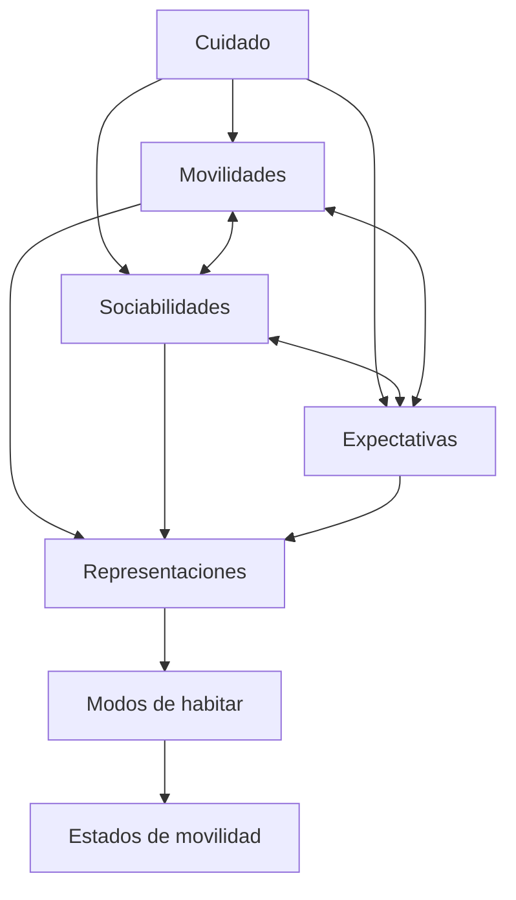
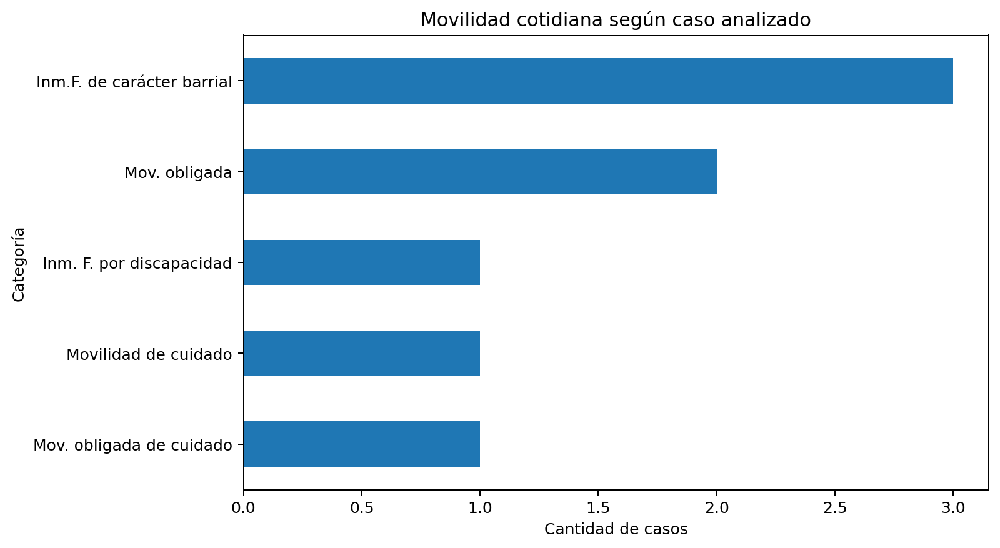
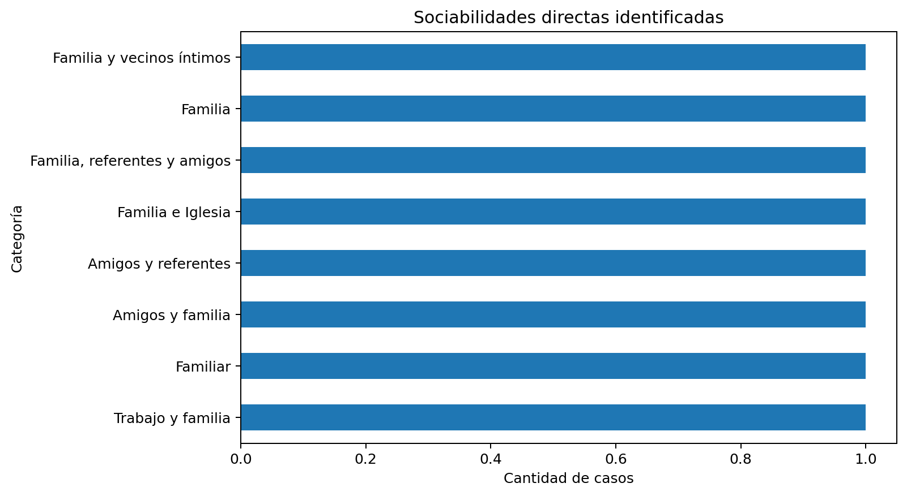
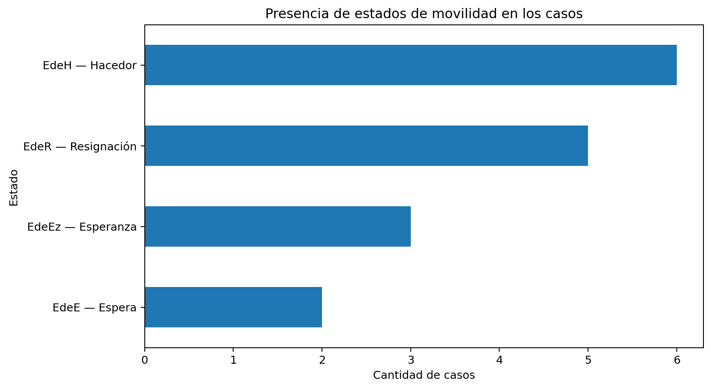

# Villa Itatí — Modos de habitar, movilidades y sociabilidades

### Qualitative data analysis applied to urban research

[](https://www.python.org/)
[](https://pandas.pydata.org/)
[](https://matplotlib.org/)
[](https://jupyter.org/)
[](#)

> **How can everyday mobility, social networks and expectations of
> permanence be articulated in different ways of inhabiting Villa
> Itatí?**

This project translates a qualitative urban research process into a
reproducible data workflow. It starts from interviews conducted in
**Villa Itatí, Quilmes**, and follows the path from **qualitative coding
→ analytical matrix → Python → exploratory analysis → sociological
interpretation**.

The project is part of my research on ways of inhabiting informal urban
neighborhoods and the role of **care, mobility and territorial
relationships** in shaping everyday life.

------------------------------------------------------------------------

## At a glance

|                      |                                                               |
|----------------------|---------------------------------------------------------------|
| **Research**         | Urban sociology · qualitative research · case study           |
| **Study area**       | Villa Itatí, Quilmes, Buenos Aires Province                   |
| **Fieldwork**        | 2024                                                          |
| **Analytical cases** | 8                                                             |
| **Data workflow**    | Coding → matrix → Python → EDA → interpretation               |
| **Main tools**       | Python · Pandas · NumPy · Matplotlib · Jupyter                |
| **Output**           | Structured dataset · codebook · notebook · analytical figures |

### What this project demonstrates

**I can work between social research and data analysis:** structure
qualitative evidence, operationalize analytical categories, document
data provenance, explore categorical data and produce reproducible
visualizations without reducing the sociological object to a numerical
score.

------------------------------------------------------------------------

## 01 — Research question

The project examines how three dimensions are articulated in different
cases:

- **Everyday mobilities:** how people move through and beyond the
  neighborhood.
- **Sociabilities:** family, friends, neighbors, organizations and other
  ties that provide support or enable strategies.
- **Expectations:** how people imagine their own future, the future of
  the neighborhood and younger generations.

These dimensions are analyzed together with **representations of self
and neighborhood** and the theoretical category of **states of
mobility**.

------------------------------------------------------------------------

## 02 — From interviews to a dataset

The central technical challenge was not simply to “analyze text”, but to
construct a data model that preserved the conceptual structure of the
original qualitative research.

``` text
Qualitative interviews
        ↓
Coding / analytical grid
        ↓
Conceptual categories
        ↓
Master dataset
        ↓
Python + Pandas
        ↓
EDA + cross-tabulation + visualization
        ↓
Sociological interpretation
```

The dataset therefore represents an **analytical layer of the
research**, rather than raw interview data.

### Analytical model



> **Reading note:** this diagram represents an analytical articulation,
> not a causal model.

------------------------------------------------------------------------

## 03 — Dataset

**Study area:** Villa Itatí, Quilmes, Buenos Aires Province, Argentina  
**Fieldwork:** 2024  
**Cases in the analytical matrix:** 8  
**Approach:** exploratory qualitative research + structured data
analysis

### Main dimensions

| Dimension                       | Examples                                                    |
|---------------------------------|-------------------------------------------------------------|
| **Profile**                     | age, gender, occupation, household                          |
| **Mobility**                    | everyday mobility categories                                |
| **Territorial representations** | valued / avoided areas and neighborhood representations     |
| **Sociability**                 | direct and indirect ties                                    |
| **Expectations**                | expectations for self, neighborhood and younger generations |
| **Representations**             | representations of self and neighborhood                    |
| **States of mobility**          | EdeE, EdeEz, EdeR, EdeH, EdeT                               |

The states of mobility are treated as **categorical / multi-label
analytical concepts**, not as an ordinal scale or numerical score.

------------------------------------------------------------------------

## 04 — Exploratory findings

The exploratory analysis makes several dimensions of the qualitative
research visible.

### Mobility is not only physical movement

Everyday mobility is linked to work, family, care, protection and
neighborhood-based activities. The same territorial environment can
therefore generate different mobility patterns depending on social
position, life stage and responsibilities.

### Community ties coexist with territorial fragmentation

The interviews show that neighborhood networks can operate as forms of
support and care while, at the same time, social and territorial
fragmentation can remain present. Community therefore cannot be treated
as a single homogeneous condition.

### Expectations point in different directions

Some cases orient expectations toward remaining in the neighborhood and
improving conditions there; others imagine moving out; others combine
expectations of neighborhood improvement with more individual or
family-oriented projects.

### The analytical value lies in the articulation

Rather than asking whether a case is simply “mobile” or “immobile”, the
project explores how mobility, sociability, expectations and
representations combine into different **ways of inhabiting**.

Because the matrix contains only eight cases, these patterns are treated
as **exploratory qualitative findings**, not as statistically
generalizable results.

------------------------------------------------------------------------

## 05 — Visual outputs

### Everyday mobility



### Direct sociability



### States of mobility



The visualizations are used as **analytical aids** rather than as
standalone evidence. Their interpretation remains connected to the
original qualitative material.

------------------------------------------------------------------------

## 06 — What I did with Python

The notebook demonstrates:

- data loading and inspection;
- missing-value checks;
- categorical exploration;
- frequency tables;
- cross-tabulations;
- case × state matrices;
- mobility × state analysis;
- sociability × state analysis;
- reproducible visualizations;
- export of analytical tables.

### Technical stack

**Data:** `Python` · `Pandas` · `NumPy` · data cleaning · categorical
data · missing-data handling · data dictionaries  
**Analysis:** `EDA` · frequency analysis · cross-tabulation ·
exploratory comparison · qualitative data structuring  
**Visualization:** `Matplotlib` · analytical tables · categorical
visualizations · reproducible figures  
**Research:** qualitative coding · urban sociology · case-study research
· operationalization · research ethics · data provenance  
**Reproducibility:** `Jupyter Notebook` · structured repository ·
documented dataset · codebook

------------------------------------------------------------------------

## 07 — Ethics and data provenance

The public version does **not** contain raw interview transcripts,
names, addresses or sensitive personal information.

Interviewees are represented through anonymized identifiers. The master
matrix includes a provenance layer documenting where variables were
incorporated from and distinguishing between:

- information explicitly available in the research material;
- information not yet incorporated;
- analytical categories constructed during the research.

`NA` therefore means **“not incorporated in this version of the
dataset”**, not necessarily “absence of the phenomenon”.

------------------------------------------------------------------------

## 08 — Repository structure

``` text
itati-modos-de-habitar/
├── README.md
├── data/
│   └── itati_matriz_maestra_v1.csv
├── notebooks/
│   └── itati_modos_de_habitar_analysis.ipynb
├── outputs/
│   ├── estados_movilidad.csv
│   ├── estados_movilidad.png
│   ├── movilidad_cotidiana.png
│   ├── movilidad_estado.csv
│   ├── sociabilidad_directa.png
│   └── sociabilidad_estado.csv
├── docs/
│   ├── itati_matriz_maestra_v1.xlsx
│   └── portfolio_case_study.md
├── requirements.txt
└── .gitignore
```

------------------------------------------------------------------------

## 09 — How to explore the project

1.  **Start with this README** for the research question and analytical
    logic.
2.  Open [`docs/portfolio_case_study.md`](docs/portfolio_case_study.md)
    for the short portfolio version.
3.  Open
    [`notebooks/itati_modos_de_habitar_analysis.ipynb`](notebooks/itati_modos_de_habitar_analysis.ipynb)
    to inspect the Python workflow.
4.  Open
    [`data/itati_matriz_maestra_v1.csv`](data/itati_matriz_maestra_v1.csv)
    to inspect the public analytical dataset.
5.  Browse [`outputs/`](outputs/) for the generated tables and figures.

------------------------------------------------------------------------

## 10 — Limitations and next steps

This is an **exploratory analytical dataset based on eight selected
cases**. It is not designed for statistical inference or
population-level generalization.

The next stage of the project could include:

- completing the remaining variables from the qualitative material;
- adding public-safe territorial representations;
- developing network analysis of sociability categories;
- expanding visualization of care and mobility;
- comparing cases across age and gender dimensions;
- documenting further transformations from qualitative coding to
  structured data.

------------------------------------------------------------------------

## About me

**Facundo Gastón Sasso**  
Sociologist — Universidad de Buenos Aires (UBA)  
Focus: **social research · urban studies · data analysis · territorial
inequalities**

[GitHub portfolio](https://github.com/facundosasso17-glitch/PORTFOLIO)

------------------------------------------------------------------------

*Research context: sociological fieldwork in Villa Itatí during 2024 and
subsequent analytical development within Sociology at UBA.*
